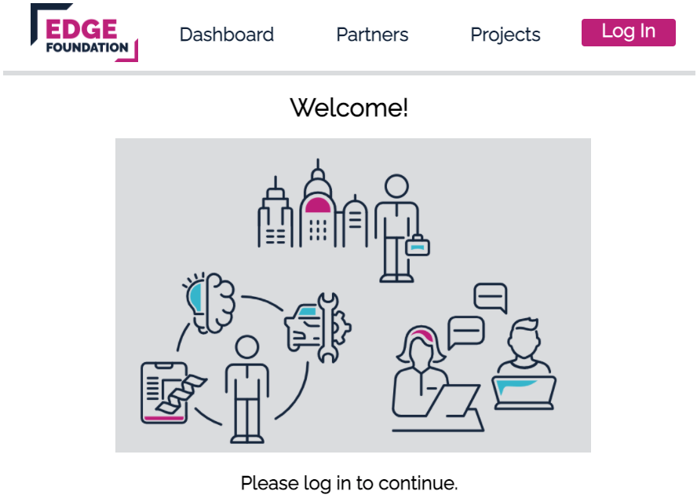
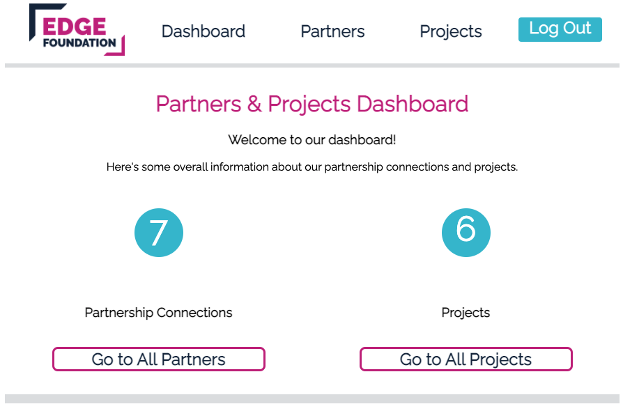
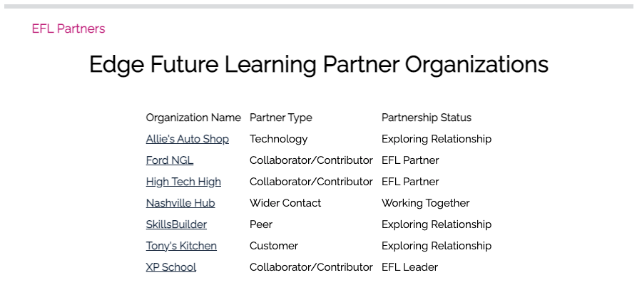
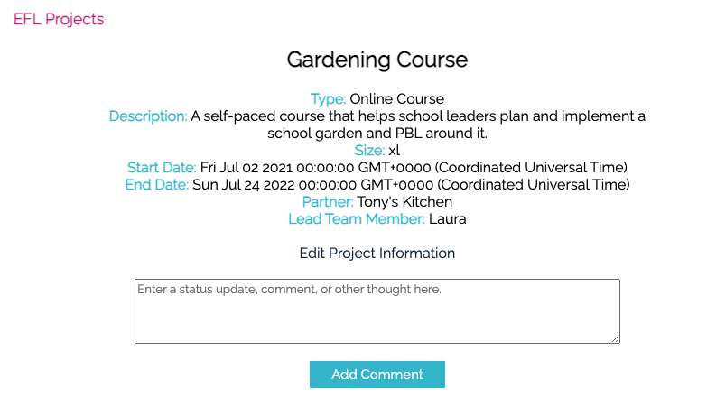
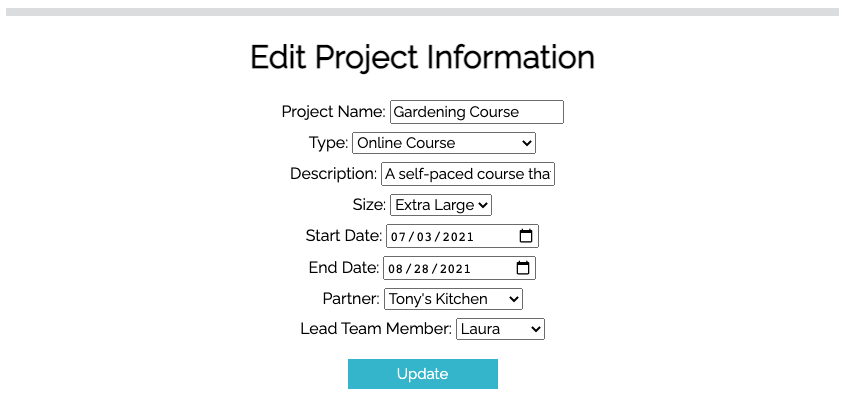
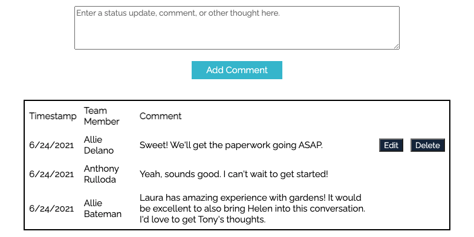

# EFL Partner & Project Management Tool
This application was developed for Edge Future Learning, an initiative of the Edge Foundation. It is a simple CRM and project management tool meant to help the team track partnership connections and partner-related projects. Once logged in through a google account, users can see a dashboard, an index of partners, and an index of projects. A user is able to add new partners and projects, view and edit details for any partner or project, as well as add comments/status updates.

## Screenshots
Dashboard:
 
---
Index of Partners:

---
Single Project View:

---
Project Edit:

---
Comments:

---

## Technologies Used
* HTML/CSS/Javascript
* Express.js
* Node
* OAuth using Passport
* Mongoose
* MongoDB Atlas

## Getting Started
Include a link to the deployed app and your Trello board with the project's planning.

I used a Trello board to help organize development of this app, from planning through deployment: [Trello](https://trello.com/b/6TJzzlFa/sei-project-2)

## Next Steps
Planned future enhancements (icebox items). COMING SOON.
